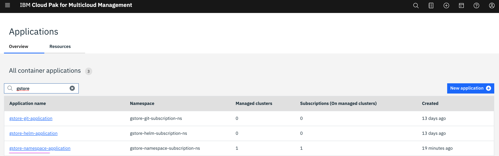
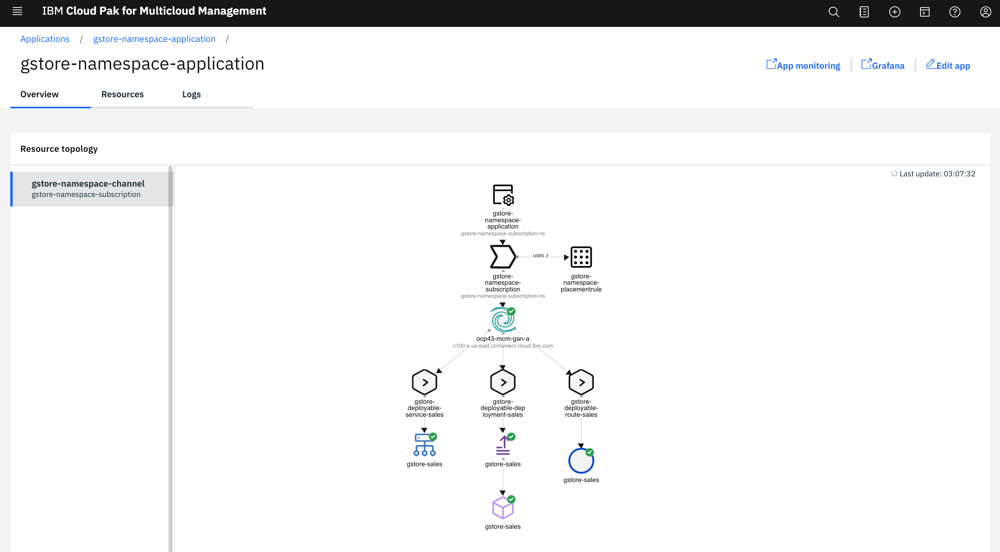
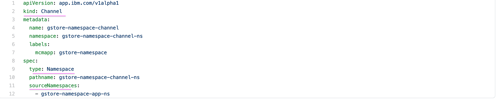
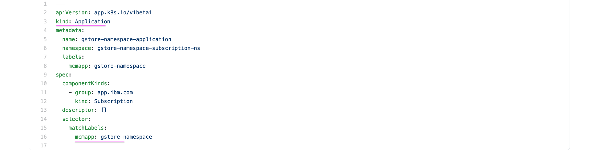
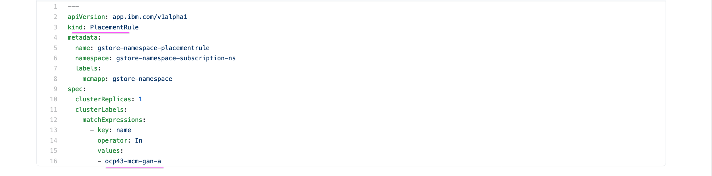
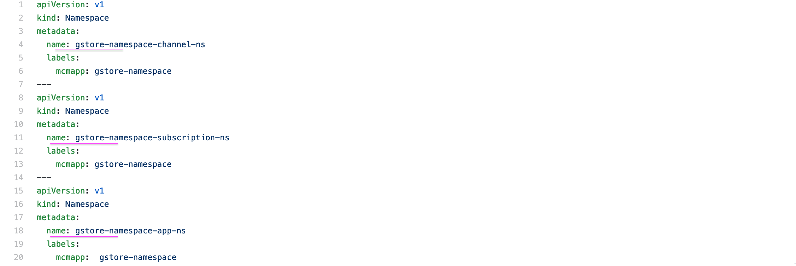
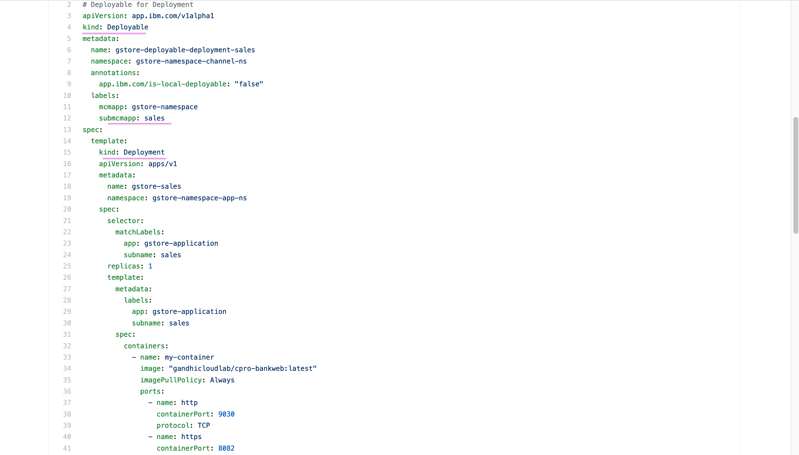
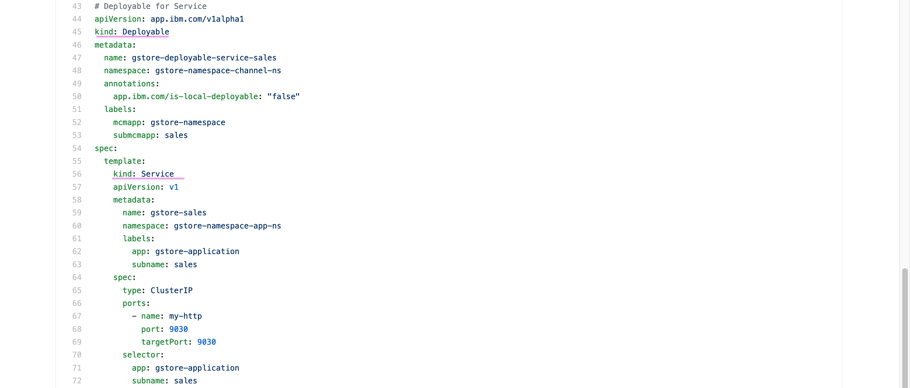
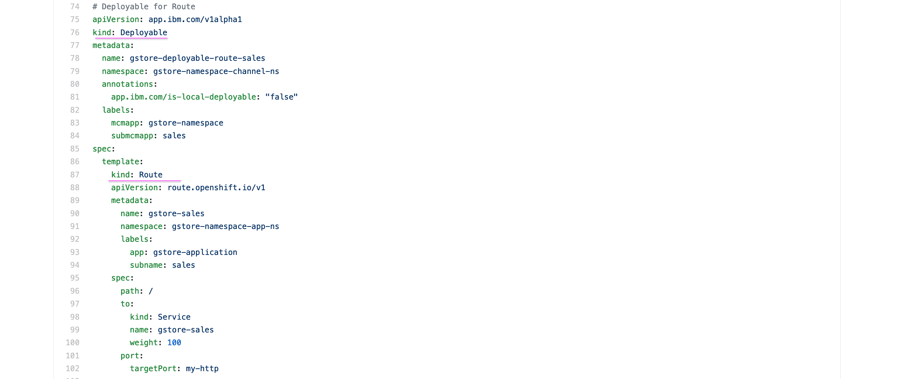

# App Deployment using NameSpace ChannelType in IBM Cloud Pak for Multi-Cloud Management

This document helps to deploy a sample MCM application using the NameSpace ChannelType. The  version of the IBM Cloud Pak for Multi-Cloud Management used here is MCM 1.3.0/1.3.2.

Application lifecycle is explained in detail at https://www.ibm.com/support/knowledgecenter/SSFC4F_1.3.0/mcm/applications/app_lifecycle.html


## 1. Installation Steps

1. Download this project from git

2. Change the below values according to your cluster in the file `/src/3-subscription/21-placement.yaml`. 

```
  clusterLabels:
    matchExpressions:
      - key: name
        operator: In
        values:
          - ocp43-mcm-gan-a
```

3. Goto `install` folder in command prompt

4. Set kubetcl context in command prompt that points to your mcm hub or do the `oc login`

5. Run the below command.

```
sh 01-install.sh
```

-------------

## 2. Accessing the installed application

The application get installed in the mcm hub.

1. Login into the managed cluster with ` oc login`  command

2. Run the below command to find the routes installed.

```
oc get route -n gstore-namespace-app-ns
```

It may result like the below.
```
NAME           HOST/PORT                                                                                                                 PATH   SERVICES       PORT      TERMINATION   WILDCARD
gstore-sales   gstore-sales-gstore-namespace-app-ns.ocp43-mcm-gan-a-.appdomain.cloud   /      gstore-sales   my-http                 None

```

3. Copy the route from the above output and open the url in the browser.

ex:
```
http://gstore-sales-gstore-namespace-app-ns.ocp43-mcm-gan-a-.appdomain.cloud
```

----------

## 3. Viewing App Topology

The deployed application would be like this in MCM Hub console.





----------

## 4. Application resources Yaml files explained

Here is some details regarding yaml files used in the application located under `src` folder.

#### Channel

Placeholder for the Deployable yaml files. The type of the channel is `namepsace`. Here it is pointing to the `gstore-namespace-app-ns` namespace in the hub as it is mentioned in the line number 12. 



#### Application

To group the components



#### Placementrule

To define the target cluster



#### Subscription

Subscription binds the deploybles available in the channel with the placement rule.

#### Namespace

Namespaces to deploy the app, channel and subscriptions.



#### Deployment

Kubernetes resource  Deployment. This deployment resource is wrapped by the Deployable resource.



#### Service

Kubernetes resource  Service.  This deployment resource is wrapped by the Deployable resource.



#### Route

Openshift resource  Route.  This deployment resource is wrapped by the Deployable resource.




